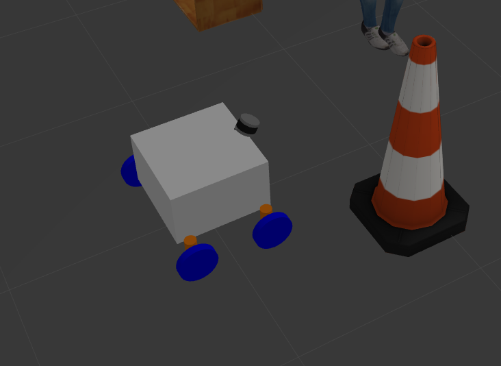
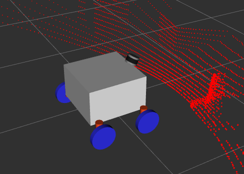

# Farmbeast_simulation
Package is for farmbeast students, its purpose is to understand and learn ROS, gazebo and robotics.



### Project still in progress

## Nedded dependecis (not sure)

```
sudo apt-get install ros-noetic-velodyne-description ros-noetic-velodyne-gazebo-plugins ros-noetic-joint-trajectory-controller ros-noetic-pointcloud-to-laserscan ros-noetic-teleop-twist-keyboard ros-noetic-ros-control ros-noetic-ros-controllers
```
## Install

```
cd ~/catkin_ws/src
git clone https://github.com/UKenda/farmbeast_simulation.git
cd ..
catkin_make
```
## To run simulation
To run simulation gazebo and rviz:
```
roslaunch farmbeast_simulation gazebo.launch
```
For running ros control:
```
rosrun farmbeast_simulation cmd_vel_control
```
To drive with keyboard:
```
rosrun teleop_twist_keyboard teleop_twist_keyboard.py
```
## Following work
Nedded to change controll.cpp to allow ackermann or any type of driving.

Nedded to chnage geometry with meshes.


